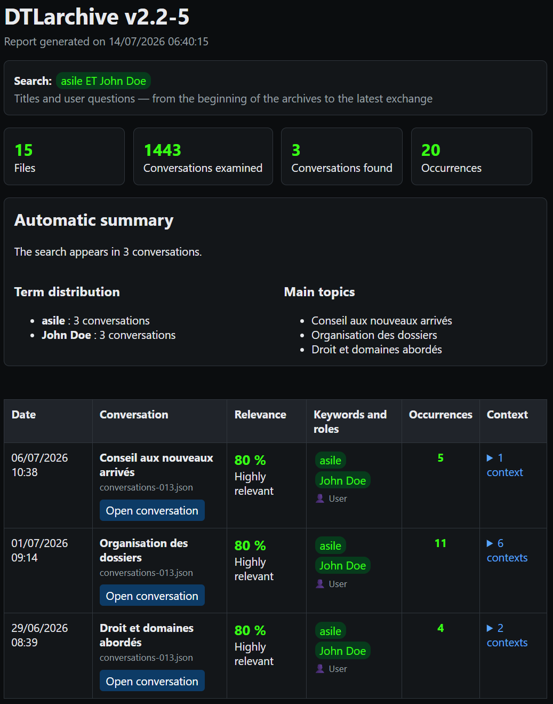

# DTLarchive

Current version: **v2.2-10**

[Version française](README_Fr.md)

Repository: [DidierMorandi/DTLarchive](https://github.com/DidierMorandi/DTLarchive)

## Presentation

**DTLarchive is a local tool for mining, searching, and reusing knowledge
contained in ChatGPT conversation archives.** It finds every conversation that
contains a word, phrase, or combination of keywords, regardless of topic.

By default, DTLarchive searches conversation titles and user questions. It can
also search titles and ChatGPT answers, or messages from both roles. Its full
interface is available in French and English, from the console to the HTML
reports and contextual help.

**Privacy:** DTLarchive runs entirely locally. No ChatGPT export is uploaded,
no search query is sent online, and no external AI service is required. The
SQLite index and reports remain on the computer.

## Why DTLarchive?

A ChatGPT export can contain thousands of conversations spread across several
JSON files. DTLarchive turns these archives into a persistent local index so
you can quickly retrieve a subject, restore its context, and reuse the results
in other knowledge-management tools.

## Screenshot



## Key features

- local, persistent SQLite full-text index;
- incremental import of new or modified `conversations*.json` files;
- searches by word, phrase, combination, exclusion, or word prefix;
- date filtering with validation against the period covered by the archives;
- searches across questions, answers, or both, with titles always included;
- French and English interfaces with contextual help;
- relevance ranking and immediate context around every match;
- navigable HTML reports and reusable JSON output;
- fully local processing with no archive or query sent online.

Version 2.2 introduced the persistent SQLite index. Later searches reuse this
index instead of reading every archive again.

## Using the executable

1. Open `DTLarchive.exe`.
2. To use the English interface, type `1` at the first prompt and press Enter.
   DTLarchive repeats the selection prompt in English; press Enter again.
3. Select one or more `conversations*.json` files from a ChatGPT export.
4. Let DTLarchive update its local index. Unchanged archives are reused without
   being parsed again.
5. Review the date range covered by the selected conversations.
6. Optionally enter inclusive start and end dates in `dd/mm/yyyy` format.
   Leave either field empty to remove that limit.
7. Enter the keyword query and choose where to search.
8. Wait while the index is searched, then press a key to open the HTML report
   in the default browser.

The selected language applies to the console, contextual help, file-selection
window, errors, HTML report, conversation pages, and diagnostic log. At an
interactive prompt, type `?`, `help`, or `h` for help with the current question.

DTLarchive rejects a period that does not overlap the selected archives. A
partially overlapping period remains valid. Leaving both dates empty searches
the entire archive.

## Search syntax

- `retirement` searches for one word;
- `white card` searches for the complete phrase;
- `insurance, pension` finds conversations containing either term;
- `asylum AND John Doe` requires both terms in the same conversation;
- `asylum AND John Doe, pension` means `(asylum AND John Doe) OR pension`;
- `asylum OR pension` explicitly uses alternative terms;
- `"asylum" AND "John Doe"` also accepts quoted terms;
- `print*` finds words beginning with `print`;
- `backup, -network` finds `backup` while excluding conversations containing
  `network`.

`AND` (or `ET`) is the AND operator. `OR` (or `OU`), a comma, or a semicolon is
the OR operator. A leading minus sign excludes a term. Searches are
case-insensitive and accent-insensitive. Simple singular forms also match their
common plural form.

## Scope

Interactive mode offers three scopes:

1. titles and user questions — default;
2. titles and ChatGPT answers;
3. titles, user questions, and ChatGPT answers.

Conversation titles are included in every scope.

## Results

Interactive runs create the following files next to the application:

```text
DTLarchive-index.sqlite
DTLarchive-output\
├── conversations\
│   └── conversation-<identifier>.html
├── DTLarchive-report.html
└── mining_results.json
```

The main report contains:

- the query, selected scope, requested period, and processing statistics;
- one row per matching conversation, with its date, title, and source file;
- matched keywords, roles, and occurrence count;
- a relevance score and label;
- up to two messages before and after a match;
- a button that opens the full conversation at the first matching message;
- an overview of term distribution and the most frequent matching conversation titles.

The relevance score prioritizes title matches, followed by user-question
matches and then ChatGPT-answer matches. It also increases with the number of
occurrences and distinct matched terms. `mining_results.json` contains the same
findings and run metadata in a reusable format.

This structured output allows DTLarchive to act as a first stage for knowledge
extraction, comparison, or knowledge-base enrichment tools.

## SQLite index

The default index is stored next to the application:

```text
DTLarchive-index.sqlite
```

The database contains source-file fingerprints, unique conversations, ordered
messages, source provenance, and an SQLite FTS5 full-text index. A conversation
appearing in several selected exports is stored only once, while its source
links are preserved. When a source changes, DTLarchive keeps the newest
available version of each conversation.

File size and modification time provide a fast unchanged-file check. A SHA-256
fingerprint prevents unnecessary reimport when only file metadata has changed.
Use `--reindex` when a complete rebuild is required.

## Command line

DTLarchive accepts individual archive files or directories. Directories are
searched for `conversations*.json` by default.

```powershell
python .\DTLarchive.py D:\Archives\ChatGPT `
  --mots-cles "asylum AND John Doe, OFPRA" `
  --date-debut 01/01/2024 `
  --date-fin 31/12/2025 `
  --role user
```

The same options can be passed to `DTLarchive.exe`. Available search scopes are
`--role user`, `--role assistant`, and `--role both`.

Useful options:

- `--output PATH` selects the output directory;
- `--pattern PATTERN` changes the archive filename pattern;
- `--index PATH` selects another SQLite index file;
- `--reindex` clears and rebuilds the selected index;
- `--quiet` suppresses the result summary in the console;
- `--lang en` selects English and `--lang fr` selects French;
- `--version` displays the program version.

An invalid date, a reversed period, or a period outside the archive range stops
command-line execution with exit code `2`.

## Building with PyInstaller

To build the Windows executable, install PyInstaller with
`python -m pip install pyinstaller`, open PowerShell in the DTLarchive folder,
then run:

```powershell
python -m PyInstaller --clean --noconfirm .\DTLarchive.spec
```

The generated file is written to `dist\DTLarchive.exe`.

## Diagnostics

Each run appends diagnostic events to a color HTML log:

```text
logs\DTLarchive_YYYYMMDD.html
```

The log records startup, selected parameters, completed searches, and fatal or
input-related errors. It also indicates how many archive files were imported or
reused from the index, without sending any information outside the computer.

## License

DTLarchive is released under the [MIT License](LICENSE).

Copyright © 2026 Didier DTL Morandi — [www.netdtl.com](https://www.netdtl.com/)
