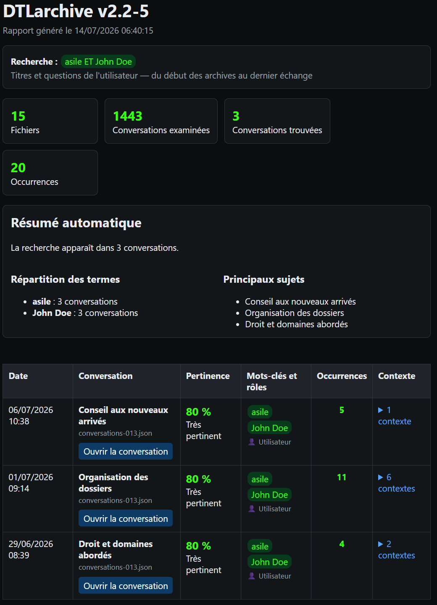

# DTLarchive

Version actuelle : **v2.2-10**

[English version](README.md)

Dépôt : [DidierMorandi/DTLarchive](https://github.com/DidierMorandi/DTLarchive)

## Présentation

**DTLarchive est un outil local de fouille, de recherche et de capitalisation
des connaissances contenues dans les archives de conversations ChatGPT.** Il
permet de retrouver toutes les conversations qui contiennent un mot, une
expression ou une combinaison de mots-clés, quel que soit leur sujet.

Par défaut, DTLarchive recherche dans les titres des conversations et les
questions de l'utilisateur. Il peut également chercher dans les titres et les
réponses de ChatGPT, ou dans les messages des deux rôles. Son interface est
disponible en français et en anglais, de la console jusqu'aux rapports HTML et
à l'aide contextuelle.

**Confidentialité :** DTLarchive fonctionne entièrement en local. Aucun export
ChatGPT n'est téléversé, aucune recherche n'est envoyée en ligne et aucun
service d'IA externe n'est requis. L'index SQLite et les rapports restent sur
l'ordinateur.

## Pourquoi DTLarchive ?

Un export ChatGPT peut contenir des milliers de conversations réparties dans
plusieurs fichiers JSON. DTLarchive transforme ces archives en un index local
persistant afin de retrouver rapidement un sujet, restaurer son contexte et
réutiliser les résultats dans d'autres outils de capitalisation des connaissances.

## Capture d'écran



## Fonctionnalités principales

- index SQLite local, persistant et en texte intégral ;
- importation incrémentale des fichiers `conversations*.json` nouveaux ou modifiés ;
- recherche par mot, expression, combinaison, exclusion ou début de mot ;
- filtrage par période et contrôle de la plage réellement couverte par les archives ;
- recherche dans les questions, les réponses ou les deux, avec les titres toujours inclus ;
- interface française et anglaise, avec aide contextuelle ;
- classement des résultats par pertinence et restitution du contexte immédiat ;
- rapports HTML navigables et export JSON réutilisable par d'autres outils ;
- traitement entièrement local, sans envoi des archives ni des recherches.

La version 2.2 introduit l'index SQLite persistant. Les recherches suivantes
réutilisent cet index au lieu de relire toutes les archives.

## Utilisation de l'exécutable

1. Ouvrez `DTLarchive.exe`.
2. Pour utiliser l'interface anglaise, tapez `1` à la première invite puis
   appuyez sur Entrée. DTLarchive répète la demande de sélection en anglais ;
   appuyez de nouveau sur Entrée.
3. Sélectionnez un ou plusieurs fichiers `conversations*.json` provenant d'un
   export ChatGPT.
4. Laissez DTLarchive mettre à jour son index local. Les archives inchangées
   sont réutilisées sans être relues.
5. Consultez la période réellement couverte par les conversations choisies.
6. Saisissez éventuellement une date de début et une date de fin inclusives au
   format `jj/mm/aaaa`. Laissez un champ vide pour supprimer cette limite.
7. Saisissez les mots-clés et choisissez où effectuer la recherche.
8. Patientez pendant la recherche, puis appuyez sur une touche pour ouvrir le
   rapport HTML dans le navigateur par défaut.

La langue choisie s'applique à la console, à l'aide contextuelle, à la fenêtre
de sélection, aux erreurs, au rapport HTML, aux pages de conversation et au
journal de diagnostic. À une invite interactive, tapez `?`, `aide`, `help` ou
`h` pour afficher l'aide correspondant à la question.

DTLarchive refuse une période qui ne recoupe pas les archives sélectionnées.
Une période partiellement couverte reste valable. Si les deux dates sont
laissées vides, l'ensemble de l'archive est pris en compte.

## Syntaxe de recherche

- `retraite` recherche un mot ;
- `carte blanche` recherche l'expression complète ;
- `mutuelle, assurance` trouve les conversations contenant l'un ou l'autre ;
- `asile ET John Doe` exige la présence des deux termes dans la même conversation ;
- `asile ET John Doe, retraite` signifie `(asile ET John Doe) OU retraite` ;
- `asile OU retraite` utilise explicitement des termes alternatifs ;
- `"asile" ET "John Doe"` accepte également les termes entre guillemets ;
- `imprim*` trouve les mots commençant par `imprim` ;
- `sauvegarde, -réseau` trouve `sauvegarde` mais exclut les conversations qui
  contiennent `réseau`.

`ET` (ou `AND`) est l'opérateur logique ET. `OU` (ou `OR`), la virgule et le
point-virgule sont des opérateurs logiques OU. Un signe moins placé devant un
terme l'exclut. La recherche ignore les majuscules et les accents. Un singulier
simple trouve aussi sa forme plurielle courante.

## Périmètre

Le mode interactif propose trois périmètres :

1. titres et questions de l'utilisateur — choix par défaut ;
2. titres et réponses de ChatGPT ;
3. titres, questions de l'utilisateur et réponses de ChatGPT.

Les titres des conversations sont inclus dans tous les périmètres.

## Résultats

En mode interactif, les fichiers suivants sont créés à côté de l'application :

```text
DTLarchive-index.sqlite
DTLarchive-output\
├── conversations\
│   └── conversation-<identifiant>.html
├── DTLarchive-report.html
└── mining_results.json
```

Le rapport principal contient :

- la recherche, le périmètre, la période demandée et les statistiques ;
- une ligne par conversation trouvée, avec sa date, son titre et son fichier source ;
- les mots-clés, les rôles concernés et le nombre d'occurrences ;
- un score et un libellé de pertinence ;
- jusqu'à deux messages avant et après une correspondance ;
- un bouton ouvrant la conversation complète au premier message correspondant ;
- un aperçu de la répartition des termes et des principaux titres de conversations trouvées.

Le score privilégie les correspondances dans le titre, puis dans les questions
de l'utilisateur et enfin dans les réponses de ChatGPT. Il augmente aussi avec
le nombre d'occurrences et de termes distincts. Le fichier
`mining_results.json` contient les mêmes résultats et les informations du
traitement dans un format réutilisable.

Cette sortie structurée permet à DTLarchive de servir de première étape à des
outils d'extraction, de comparaison ou d'enrichissement de bases de connaissances.

## Index SQLite

L'index par défaut est enregistré à côté de l'application :

```text
DTLarchive-index.sqlite
```

La base contient les empreintes des fichiers sources, les conversations
uniques, les messages ordonnés, leur provenance et un index plein texte SQLite
FTS5. Une conversation présente dans plusieurs exports n'est enregistrée
qu'une fois, tout en conservant ses liens vers les fichiers sources. Lorsqu'une
source change, DTLarchive conserve la version la plus récente de chaque
conversation.

La taille et la date de modification fournissent un contrôle rapide des
fichiers inchangés. Une empreinte SHA-256 évite une réimportation inutile si
seules les informations du fichier ont changé. L'option `--reindex` force une
reconstruction complète.

## Ligne de commande

DTLarchive accepte des fichiers d'archive individuels ou des dossiers. Dans un
dossier, il sélectionne par défaut les fichiers `conversations*.json`.

```powershell
python .\DTLarchive.py D:\Archives\ChatGPT `
  --mots-cles "asile ET John Doe, OFPRA" `
  --date-debut 01/01/2024 `
  --date-fin 31/12/2025 `
  --role user
```

Les mêmes options peuvent être transmises à `DTLarchive.exe`. Les périmètres
disponibles sont `--role user`, `--role assistant` et `--role both`.

Options utiles :

- `--output CHEMIN` choisit le dossier de sortie ;
- `--pattern MOTIF` modifie le motif des noms de fichiers d'archive ;
- `--index CHEMIN` choisit un autre fichier d'index SQLite ;
- `--reindex` efface et reconstruit l'index sélectionné ;
- `--quiet` masque le résumé des résultats dans la console ;
- `--lang en` sélectionne l'anglais et `--lang fr` sélectionne le français ;
- `--version` affiche la version du programme.

Une date invalide, une période inversée ou une période extérieure aux archives
provoque un arrêt avec le code de sortie `2`.

## Compilation PyInstaller

Pour construire l'exécutable Windows, installez PyInstaller avec
`python -m pip install pyinstaller`, ouvrez PowerShell dans le dossier de
DTLarchive, puis exécutez :

```powershell
python -m PyInstaller --clean --noconfirm .\DTLarchive.spec
```

Le fichier généré est placé dans `dist\DTLarchive.exe`.

## Diagnostic

Chaque lancement ajoute les événements de diagnostic dans un journal HTML en
couleurs :

```text
logs\DTLarchive_AAAAMMJJ.html
```

Le journal enregistre le démarrage, les paramètres choisis, les recherches
terminées et les erreurs fatales ou liées aux saisies. Il indique également le
nombre d'archives importées ou réutilisées depuis l'index, sans envoyer
d'information hors de l'ordinateur.

## Licence

DTLarchive est distribué sous [licence MIT](LICENSE).

Copyright © 2026 Didier DTL Morandi — [www.netdtl.com](https://www.netdtl.com/)
